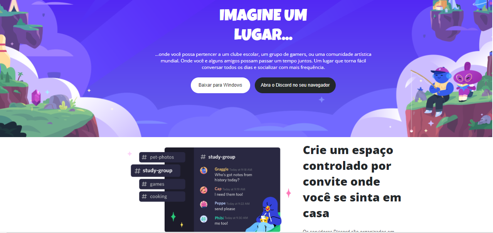
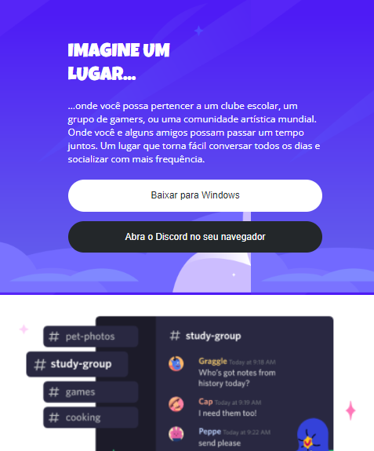

## 👨‍💻 Desafio de Projeto CSS: Construindo um Layout Responsivo Para o Site do Discord Com CSS

Projeto de HMTL e CSS do clone da página do Discord usando os conceitos de responsividade e mobile first. 
Esse projeto foi proposto da plataforma educacional DIO na Formação CSS Developer.

## 💻 Tecnologias usadas:

  
  

## 🖥 Preview:

Site em um Desktop:

  

 
Site em um dispositivo menor, como por exemplo um celular:

  

## 🤔 O que foi feito nesse projeto:

- Criei um clone da página do Discord usando os conceitos de mobile first e responsividade;
- Usei as unidades de medidas relativas, aqui nesse projeto optei pel unidade de medida relativa `rem`;
- Neste projeto segui as orientações do arquivo do Figma disponibilizado no curso.

## 📌 Créditos

- **Assets:** Disponível no protótipo do Figma disponibilizado no curso.
